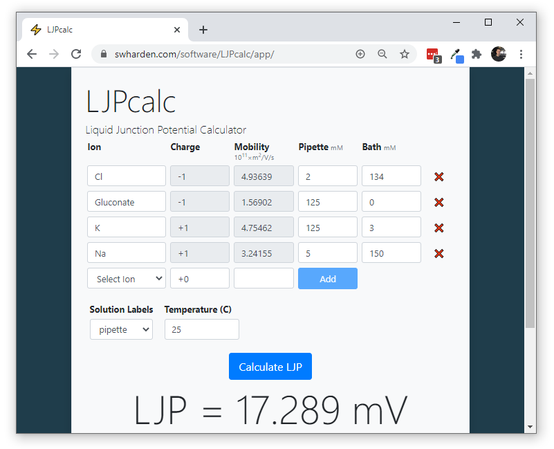

# LJPcalc

**LJPcalc** is a free and open source liquid junction potential (LJP) calculator that runs in the browser.

### [Click Here to Launch LJPcalc](https://swharden.com/software/LJPcalc/app)

## Citing LJPcalc

If you enjoy using LJPcalc, consider citing it by name so others may benefit from it as well

> _Liquid junction potential was calculated according to the Nernst–Planck equation ([Marino et al., 2014](https://arxiv.org/abs/1403.3640)) using LJPcalc software (https://github.com/swharden/LJPcalc)._

## Authors
LJPcalc was created by [Scott Harden](http://swharden.com/) as a C#/.NET adaptation of the Java application [JLJP](https://github.com/swharden/JLJP) originally written by [Doriano Brogioli](https://sites.google.com/site/dbrogioli/) as described in [Marino et al., 2014](https://arxiv.org/abs/1403.3640).

## Resources
* [LJP Theory and Calculation Tips](https://swharden.com/software/LJPcalc/theory/)
* [Marino et al., 2014](https://arxiv.org/abs/1403.3640) - A new open source software for the calculation of the liquid junction potential between two solutions according to the stationary Nernst-Planck equation
* [Marino and Brogioli 2016](https://www.mdpi.com/2079-3197/4/2/17) - Analytical Results on the Behavior of a Liquid Junction across a Porous Diaphragm or a Charged Porous Membrane between Two Solutions According to the Nernst–Planck Equation
* [Beaumont 1991](https://pubmed.ncbi.nlm.nih.gov/1886854/) - Comparison of Henderson's Method I and restricted maximum likelihood estimation of genetic parameters of reproductive traits