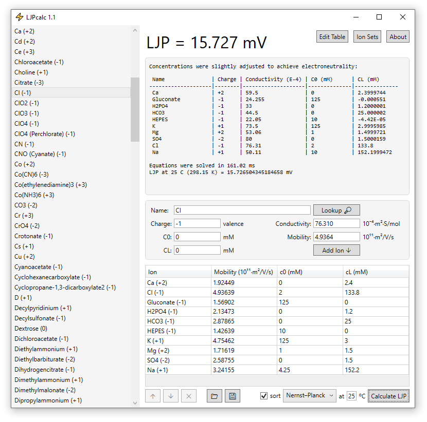

# LJPcalc

LJPcalc is a free and open source liquid junction potential (LJP) calculator.

  

## LJPcalc Website

* Home Page: https://swharden.com/software/LJPcalc
* Theory: https://swharden.com/software/LJPcalc/theory.md.html
* Download: https://swharden.com/software/LJPcalc/download.md.html

## Developer Notes 

### Building in Windows
* Install [Visual Studio Community](https://visualstudio.microsoft.com/vs/community/) (free)
* Open [/src/LJP.sln](/src/LJP.sln) in Visual Studio
* Right-click the LJPcalc project and select "Set as StartUp Project"
* Press F5 to build and run

### Source Code Project Structure

The primary LJP math is entirely handled in the LJPmath module which targets [.NET Standard 2.0](https://docs.microsoft.com/en-us/dotnet/standard/net-standard) so it works on modern systems like .NET Core, .NET Framework, and Xamarin. LJPcalc and LJPconsole now dual-target .NET Core and .NET Framework.

Project | Platform | Purpose
---|---|---
LJPmath | .NET Standard 2.0 | Platform-independent library to calculate LJP
LJPconsole | .NET Core 2 | Cross-platform console-based LJP calculator
LJPcalc | .NET Core 3 .NET Framework 4.7.2 | Graphical LJP calculator for Windows (WPF)
LJPapp | Xamarin.Forms | Mobile app for iPhone and Android
LJPresearch | .NET Core | Tool for writing experimental LJP calculations
LJPtest | .NET Core | Tests for the LJPmath module

### Authors
LJPcalc was created by [Scott W Harden](http://swharden.com/) in 2020. LJPcalc began as C# port of [JLJP](https://github.com/swharden/JLJP) by [Doriano Brogioli](https://sites.google.com/site/dbrogioli/) originally published on SourceForge in 2013. LJPcalc is heavily influenced by [Marino et al., 2014](https://arxiv.org/abs/1403.3640).
