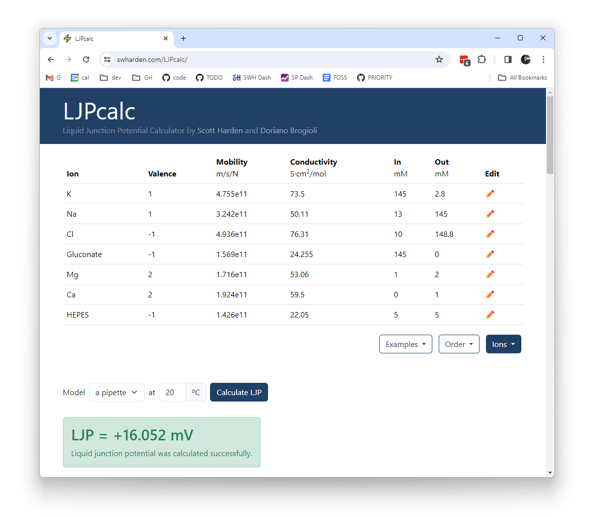

# LJPcalc

**LJPcalc is a free and open source liquid junction potential (LJP) calculator that runs entirely in the browser.** LJPcalc calculates LJP according to the stationary Nernst-Planck equation. This strategy is typically regarded as superior to the simpler Henderson equation used by most commercial LJP calculators, especially for solutions containing polyvalent ions.

## Citing LJPcalc

**If you enjoy LJPcalc, consider citing it by name:** Liquid junction potential was calculated according to the stationary Nernst–Planck equation ([Marino et al., 2014](https://arxiv.org/abs/1403.3640)) using LJPcalc (https://swharden.com/LJPcalc/, [RRID:SCR_025044](https://scicrunch.org/resources)).

[Search "LJPcalc" on Google Scholar](https://scholar.google.com/scholar?q=ljpcalc) to see publications that cite LJPcalc.

## History

LJPcalc was created by [Scott Harden](http://swharden.com/) as a C#/.NET adaptation of the Java application [JLJP](https://github.com/swharden/JLJP) originally written by [Doriano Brogioli](https://sites.google.com/site/dbrogioli/) as described in [Marino et al., 2014](https://arxiv.org/abs/1403.3640).

## Additional Resources

* [**LJP Theory and Calculation Tips**](https://swharden.com/software/LJPcalc/theory/) - A collection of information related to LJP I put together while working on this project.

* [**Marino and Brogioli, 2016**](https://www.mdpi.com/2079-3197/4/2/17) - Analytical Results on the Behavior of a Liquid Junction across a Porous Diaphragm or a Charged Porous Membrane between Two Solutions According to the Nernst–Planck Equation

* [**Beaumont 1991**](https://pubmed.ncbi.nlm.nih.gov/1886854/) - Comparison of Henderson's Method I and restricted maximum likelihood estimation of genetic parameters of reproductive traits

* **[Marino et al. (2014)](https://arxiv.org/abs/1403.3640)** - describes a computational method to calculate LJP according to the stationary Nernst-Planck equation. The JAVA software described in this manuscript is open-source and now on GitHub ([JLJP](https://github.com/swharden/jljp)). Figure 1 directly compares LJP calculated by the Nernst-Planck vs. Henderson equation.

* **[Perram and Stiles (2006)](https://pubs.rsc.org/en/content/articlelanding/2006/cp/b601668e)** - A review of several methods used to calculate liquid junction potential. This manuscript provides excellent context for the history of LJP calculations and describes the advantages and limitations of each.

* **[Shinagawa (1980)](https://www.ncbi.nlm.nih.gov/pubmed/7401663)** _"Invalidity of the Henderson diffusion equation shown by the exact solution of the Nernst-Planck equations"_ - a manuscript which argues that the Henderson equation is inferior to solved Nernst-Planck-Poisson equations due to how it accounts for ion flux in the charged diffusion zone.

* **[Lin (2011)](http://www.sci.osaka-cu.ac.jp/~ohnita/2010/TCLin.pdf)** _"The Poisson The Poisson-Nernst-Planck (PNP) system for ion transport (PNP) system for ion transport"_ - a PowerPoint presentation which reviews mathematical methods to calculate LJP with notes related to its application in measuring voltage across cell membranes.

* **[Nernst-Planck equation](https://en.wikipedia.org/wiki/Nernst%E2%80%93Planck_equation)** (Wikipedia)

* **[Goldman Equation](https://en.wikipedia.org/wiki/Goldman_equation)** (Wikipedia)

* **[EGTA charge and pH](https://www.sciencedirect.com/science/article/pii/S0165027099000369?via%3Dihub#FIG1)** - Empirical determination of EGTA charge state distribution as a function of pH.

* **[LJPCalcWin](https://medicalsciences.med.unsw.edu.au/sites/default/files/soms/page/ElectroPhysSW/JPCalcWin-Demo%20Manual.pdf)** - A Program for Calculating Liquid Junction Potentials

* **[LJP Corrections](http://beenhakkerlab.org/lab-links/ephys/Guides/Theory/Liquid-Junction-Potential-Corrections-Axon.pdf)** (Axon Instruments Application Note) describes how to calculate LJP using ClampEx and LJPCalcWin and also summarizes how to measure LJP experimentally

* **[LJP Corrections](https://medicalsciences.med.unsw.edu.au/sites/default/files/soms/page/ElectroPhysSW/AxoBits39New.pdf)** (Figl et al., AxoBits 39) summarizes LJP and discusses measurement and calculation with ClampEx